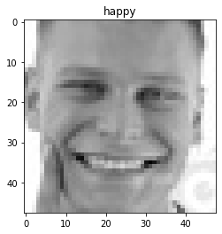
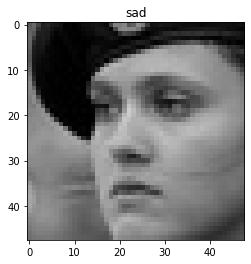
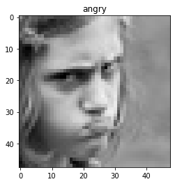

# Detect Face Emotions Using CNN

### Table of contents
* [General info](#general-info)
* [Technologies](#technologies)
* [Example output](#example-output)

#### General Info
Deep Learning project, which I worked on in a group of 3 members during the semester. 
We trained our model on FER2013 dataset, which contains app. 30,000 facial images of 7 different facial expressions (0=Angry, 1=Disgust, 2=Fear, 3=Happy, 4=Sad, 5=Surprise, 6=Neutral). We divided most of the data for training use, and the rest for the testing part.  
Afterwards, we prepared the model using Keras library's:  
* Conv2D() - 2D convolution layer which need as input the number of output filters in the convolution and their size, also the used activation function (normally ReLU) and regularizers. 
* BatchNormalization() - This method normalizes the contributions to a layer for every mini-batch by re-centering and re-scaling. 
* MaxPooling2D() - With a pool size of (2,2) matrices (which uses the max value). 
* Flatten() - Convert the array into one dimensional array. 
* Dense() - Which takes as input the dimensionality of the output space from every neuron of its preceding layer and an activation function (used ReLU), where neurons of the dense layer perform matrix-vector multiplication. 
* Dropout() - Is used to prevent the model training from overfitting! Dropout works by randomly setting the outgoing edges of hidden layers to 0 at each update of the training phase. 
* Used "categorical crossentropy" for the loss function.

#### Technologies
* Python
* Keras library
* Matplotlib
* Numpy
* OpenCV package
* Spyder IDE

#### Example output
 
 
 
